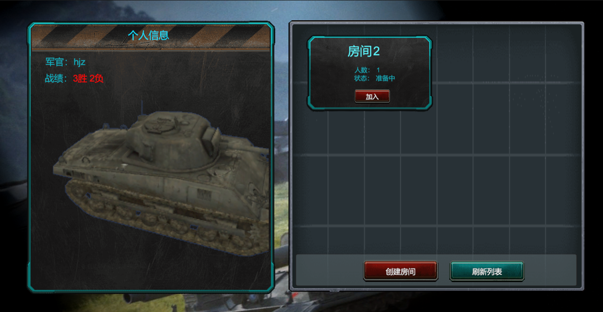
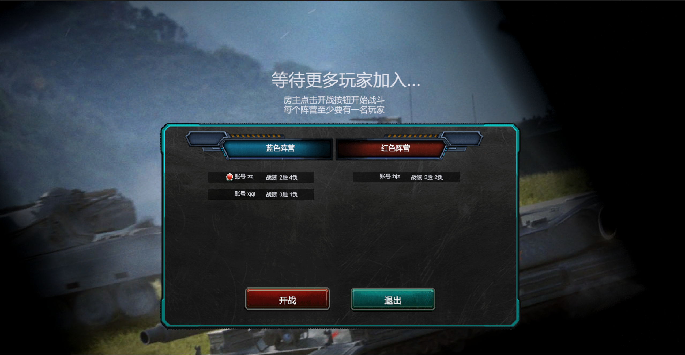

多人坦克大战游戏

使用Unity和C#开发的一款多人坦克大战游戏。项目整体由客户端和服务器组成，包含注册登录、游戏大厅、房间系统和战斗系统，使用MySQL存储账号、密码和战绩相关数据，对于网络模块，客户端使用异步，服务端使用select多路复用。

项目细节：

1.实现了一套通用客户端网络模块和服务端框架，解决了粘包分包、完整发送数据、协议解析、心跳机制和数据库存储等功能。

2.实现了注册登录，玩家可以注册账号进行登录，账号密码等相关信息存储于MySQL数据库中。

3.实现了游戏大厅，玩家可以在游戏大厅创建房间，也可以看见其他玩家创建的房间信息(游戏状态和房间人数)并选择加入。

4.实现了房间系统，房主可以在有其他玩家进入房间后开战，开战后所有玩家进入战场控制坦克进行战斗，玩家可以在开战前退出房间，房间中的玩家可以看见自己所处的阵营以及其他玩家的相关信息（阵营和战绩）。

5.实现了战斗系统，在战场中，玩家可以控制坦克行走、瞄准和开炮，战场中每隔一段时间会随机生成各种道具（血包、攻击Buff以及迅捷Buff），玩家可以控制坦克拾取道具获得相应增益。

